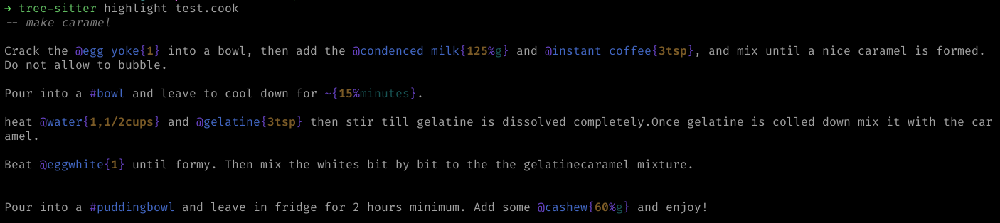
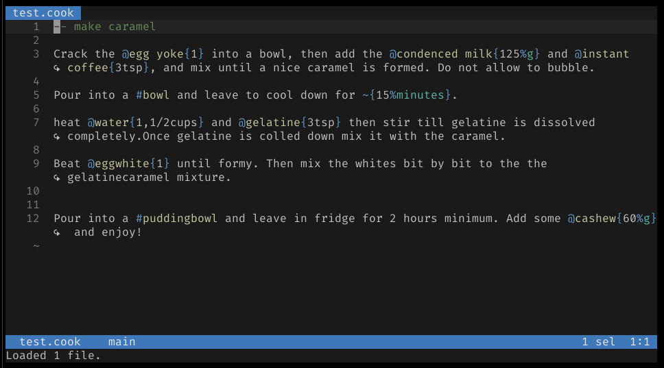

# Tree-sitter-cooklang

<!--toc:start-->

- [Tree-sitter-cooklang](#tree-sitter-cooklang)
  - [Testing the grammar](#testing-the-grammar)
  - [Using the syntax highlight](#using-the-syntax-highlight)
    - [With tree-sitter](#with-tree-sitter)
    - [With Helix](#with-helix)
  - [Reference](#reference)
  <!--toc:end-->

This is an unofficial tree-sitter grammar for [Cooklang](https://cooklang.org/).

## Testing the grammar

- `tree-sitter generate` to compile the grammar and generate the different bindings.
- `tree-sitter test` to run the tests (in `corpus` folder)
- `make clean` to remove all generated files

## Using the syntax highlight

### With tree-sitter

To use the syntax highlight with tree-sitter, follow the indication in the [doc](https://tree-sitter.github.io/tree-sitter/syntax-highlighting). Then you can run `tree-sitter highlight {your_file}.cook`. You should see something like



### With Helix

Follow the indication in the [adding languages page](https://docs.helix-editor.com/guides/adding_languages.html), or:

- Edit your `language.toml` file to add

  ```toml
  [[language]]
  name = "cooklang"
  scope = "source.cook"
  file-types = ["cook"]
  roots = []

  [[grammar]]
  name = "cooklang"
  source = { path = "/local/path/to/tree-sitter-cooklang"}
  ```

- In your helix configuration folder, be sure that the folders `runtime/grammars` and `runtime/queries/cooklang` exists.
- Copy the content of the `queries` folder to your personal `runtime/queries/cooklang`
- build the grammar by doing `hx --grammar build cooklang`



## Reference

- [Cooklang EBNF](https://github.com/cooklang/spec/blob/main/EBNF.md)
